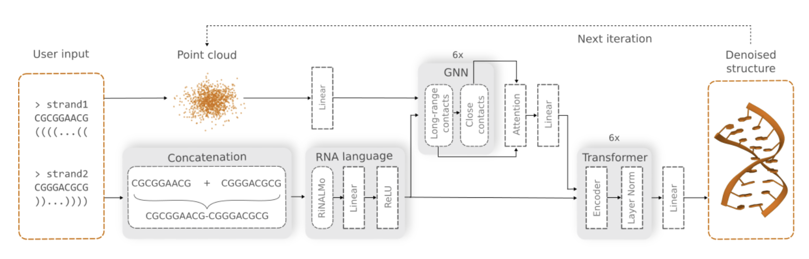
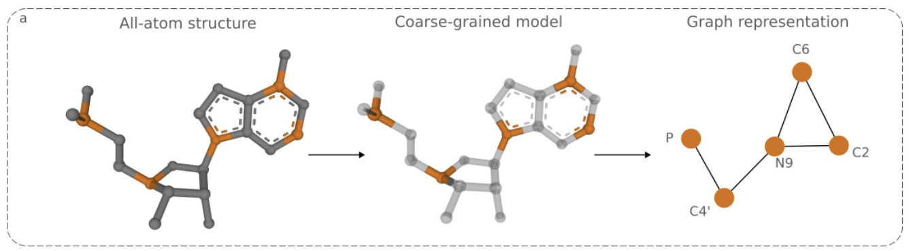

# Stanford RNA 3D Folding Kaggle Challenge  
Advanced Machine Learning Semester Project

Niklas Schmidt (niklas.schmidt@uzh.ch) 
Elias Müller (eliaswalterjosef.mueller@uzh.ch) 
Diyar Taskiran  (diyar.taskiran@uzh.ch)

April 15, 2025

## 1 Motivation

Understanding RNA and its structure is a critical task in modern life sciences. While AlphaFold [4] has revolutionized protein structure prediction, similar progress in RNA remains limited due to scarce and imbalanced data. Recently, novel RNA 3D structure prediction methods that applies Graph Neural Networks (GNN) and Denoising Diffusion Probabilistic Models (DDPM) have shown superior performance [8]. Their approach focuses on efficiently predicting the structure of RNA substructures (local descriptors) and combining those into the structure of a full molecule. Although this method demonstrates superior performance compared to AlphaFold on RNA targets, its reliance on the DDPM architecture incurs substantial computational demands.

While achieving SOTA results in many generative ML tasks, standard Denoising Diffusion Probabilistic Models (DDPMs) require a backwards pass through a full Markov chain for each sample. This is computationally expensive and often slow. Various techniques have been developed to address this bottleneck. For instance, Denoising Diffusion Implicit Models (DDIMs) [2] generalize the forward process to allow for deterministic, non-Markovian sampling paths, significantly reducing the number of steps needed. More recently, methods like Inductive Moment Matching (IMM) [7] aim to achieve efficient one or few-step sampling through alternative training procedures designed for stability and speed. Both approaches represent efforts to make powerful diffusion-based generative modeling more computationally tractable.

This project aims to integrate more efficient sampling techniques, such as DDIM and IMM, into the RNAgrail framework. By replacing the computationally demanding DDPM sampler with faster alternatives, we seek to substantially reduce the time required for predicting RNA substructures. This enhancement would make advanced RNA 3D structure prediction more accessible and practical, enabling faster exploration of RNA structures while striving to maintain the high accuracy established by the original RNAgrail model.

## 2 Overview

This project investigates the potential of integrating efficient diffusion sampling techniques into the RNAgrail framework for predicting the 3D structures of ribonucleic acid (RNA). Specifically, we aim to adapt the RNAgrail architecture by leveraging faster sampling methods, such as Denoising Diffusion Implicit Models (DDIMs) and potentially Inductive Moment Matching (IMM), to reduce the substantial computational demands associated with standard DDPM sampling.

The project will be structured as follows: First, we will apply the pretrained RNAgrail model to the Stanford RNA 3D Folding Kaggle challenge [6] dataset as a baseline benchmark. Next, we will explore and implement variations of the original model architecture by replacing the DDPM sampler with more efficient non-Markovian alternatives like DDIM and potentially investigating one or few-step sampling methods like IMM. Finally, we will compare the performance of these variants, evaluating the trade-offs between computational speed and prediction accuracy in the context of RNA 3D structure prediction.

## 3 Problem Formulation

The goal of RNA structure prediction is to develop a model that takes as input a sequence of RNA and outputs the 3D position of each nucleotide. Formally, given an input RNA sequence  
$S = ⟨n₁, n₂, . . . , n_N⟩$,  
where nᵢ represents the ith nucleotide in the sequence of length N, the objective is to predict a corresponding sequence of 3D coordinate vectors  
$P = ⟨p₁, p₂, . . . , p_N⟩$,  
where each $pᵢ = (xᵢ, yᵢ, zᵢ) ∈ ℝ³$ represents the spatial coordinates of the ith nucleotide nᵢ. The baseline model achieves this by applying a DDPM to a point-cloud of the individual nucleotides, conditioned on the output of a GNN (see Section 4). The goal of this work is to modify the DDPM section of the model by applying DDIM or IMM.

Denoising Diffusion Probabilistic Models (DDPM) [2] learn to reverse a fixed process that gradually adds noise to data ($x₀$). A network $ϵ_θ(x_t, t)$ is trained to predict the noise at each step t of this noising process. Generating samples requires simulating the learned reverse process step-by-step ($x_T → · · · → x₀$) for many steps ($T$), which is computationally slow.

Denoising Diffusion Implicit Models (DDIM) [2] enable faster sampling using the same trained network $ϵ_θ(x_t, t)$. It employs a non-Markovian process allowing deterministic updates (for variance $σ = 0$) that skip steps via the relation:

$$
x_{τ_{i-1}} = \sqrt{\bar\alpha_{τ_{i-1}}} \ (\text{predicted } x_0) + \sqrt{1-\bar\alpha_{τ_{i-1}}} \, ϵ_θ(x_{τ_i}, τ_i)
$$

This uses a short subsequence of timesteps $\{τ₁, ..., τ_S\} (S ≪ T)$, where the predicted x₀ is derived from $x_{τ_i}$ and $ϵ_θ(x_{τ_i}, τ_i)$.

Inductive Moment Matching (IMM) [7] aims for highly efficient one-step or few-step generation, often using a distinct training objective (e.g., matching moments of distributions across noise levels) rather than requiring a pre-trained DDPM/DDIM model.

Therefore, while the overall problem remains predicting the full RNA structure P from the sequence S, this project specifically reformulates the generative sampling sub-problem for local descriptors within RNAgrail. We aim to replace the computationally intensive iterative DDPM sampling process with faster alternatives based on DDIM and potentially IMM, evaluating the trade-off between sampling speed and the accuracy of the final predicted RNA structure.

## 4 Related Work

The following paragraph explains the baseline implementation by Justyna et al. [8].

### 4.1 High Level Architecture

**Figure 1: RNA Architecutre**  

RNAgrail predicts RNA 3D structures from sequence and secondary structure using three main components: an RNA language model, a graph neural network (GNN), and a transformer. It leverages RiNALMo (vgl. [5]), a pre-trained RNA language model for enhanced performance. A modified PAMNet GNN considers both short- and long-range atomic interactions, outputting atom coordinates, types, and residue types and thus provides structural embeddings for the transformer. Finally, a transformer, inspired by AlphaFold’s IPA ([1]), refines the 3D structure prediction.

**GNN Architecture**

The second component for RNA 3D structure prediction utilizes a modified PAMNet (see [3]), a graph neural network, to consider both short (0-5 Å) and long-range (up to 16 Å) atomic interactions by employing two distinct layers and outputting atomic coordinates, types, and residue types. The GNN has the following characteristics: Each atom is represented as a node. Nodes are connected by covalent and other user-specified interactions according to 2D structural information. This two-way edge representation allows direct connectivity as well as user-specified constraints to be incorporated. The model takes into account close (top) and distant (bottom) interactions between next-nearest atoms. For feature computation, close interactions are of the following kinds: calculate distance and two types of angles: θ (between a node and its one-hop neighbors) and θ (between a node and its two-hop neighbors). For long-range interactions, only the distances are calculated.

**Figure 2: GNN Architecture**  

## 5 Self-Contribution

This project’s primary contribution lies in integrating and evaluating computationally efficient diffusion sampling techniques within the state-of-the-art RNAgrail framework for RNA 3D structure prediction. Building upon the official RNAgrail implementation [8] (available on GitHub) and pre-trained weights (available on Zenodo), our work will involve the following key technical steps:

1. **Adaptation for Target Dataset:** Modify the existing RNAgrail codebase and input/output pipelines to be directly compatible with the data format and requirements of the Stanford RNA 3D Folding Kaggle challenge [6].

2. **Implementation of Efficient Samplers:** Replace the standard Denoising Diffusion Probabilistic Model (DDPM) sampling mechanism within the generative component of RNAgrail. Specifically, we will implement and integrate:
   - **Denoising Diffusion Implicit Models (DDIM):** Leveraging its deterministic, non-Markovian sampling path to enable faster generation with fewer steps [2].
   - **(Optional/Exploratory) Few-Step Samplers:** Investigate the feasibility of integrating methods like Inductive Moment Matching (IMM) [7] or similar techniques designed for one or few-step generation, potentially requiring modifications to the training procedure if necessary.

3. **Re-training and Fine-tuning:** Train the modified RNAgrail models (using DDIM/IMM samplers) on the Kaggle dataset. This may involve fine-tuning from the original pre-trained weights or training from scratch, depending on preliminary experiments and computational feasibility.

4. **Comparative Analysis:** Systematically evaluate the trade-offs between prediction accuracy (using TM-score, see Section 6) and computational efficiency (sampling speed, training time) for the different sampler implementations compared to the original RNAgrail model.

The expected outcome is a modified RNAgrail variant that achieves significantly faster structure prediction, particularly during the sampling phase, making advanced RNA structure prediction more practical, while quantifying any potential impact on prediction accuracy.

## 6 Evaluation

The evaluation of our results will follow the established procedure used in the Kaggle competition [6]. The quality assessed by computing a Template Modeling Score (TM-score), that ranges from 0.0 to 1.0, with higher values indicating a better structural match. The score is defined as follows:

$$
\text{TM-score} = \max \left( \frac{1}{L_{ref}} \sum_{i=1}^{L_{align}} \frac{1}{1 + \left(\frac{d_i}{d_0}\right)^2} \right),
$$

where:

- **Lref** is the number of residues resolved in the experimental (ground truth) structure.
- **Lalign** is the number of aligned residues between the prediction and the reference.
- **dᵢ** represents the distance (in Angstroms) between the ith pair of aligned residues.
- **d₀** is a normalization factor (in Angstroms), which is calculated by

$$
d_0 =
\begin{cases}
0.3, & \text{if } L_{ref} < 12; \\
0.4, & \text{if } 12 \leq L_{ref} \leq 15; \\
0.5, & \text{if } 16 \leq L_{ref} \leq 19; \\
0.6, & \text{if } 20 \leq L_{ref} \leq 23; \\
0.7, & \text{if } 24 \leq L_{ref} \leq 29; \\
0.6\sqrt{L_{ref}-0.5}-2.5, & \text{if } L_{ref} \geq 30.
\end{cases}
$$

Following the protocol of the Kaggle competition, we will generate five distinct predictions for each target protein. The final structure prediction quality score will be determined by averaging the highest TM-scores (best-of-5) achieved for each target in the dataset.

Second, we will evaluate the efficiency of our method by comparing its training time against the training time of the original method presented in the referenced papers. To facilitate a direct comparison, we will train both our method and the original method on a representative subset of the training data to then measure and compare the training time per epoch for both approaches over a series of epochs. This analysis will provide insights into the potential improvements in training efficiency offered by our approach.

## 7 Baselines

To evaluate the performance and efficiency of our implementation with existing approaches, we will consider the following baselines:

- **Performance of the original RNAGrail model:** We will compare the performance of our model with the performance of the original RNAGrail [8] on the Stanford RNA 3D Folding Challenge [6] as a primary benchmark for prediction accuracy.
- **Computational resources for comparable performance:** We will assess the total compute resources required to achieve a similar level of training and evaluation performance as the original RNAgrail model on equivalent hardware on a subset of the training dataset.
- **Average inference time:** We will measure and compare the average inference time of our adapted model against the original RNAgrail model on equivalent hardware.
- **Kaggle Challenge leaderboard ranking:** We will track the rank of our submissions on the Stanford RNA 3D Folding Kaggle Challenge leaderboard. This will provide a real-world, competitive assessment of our model’s performance against other submitted approaches.

## References

[1] John Jumper et al. “Highly accurate protein structure prediction with AlphaFold”. In: *Nature* 596.7873 (2021), pp. 583–589.

[2] Jiaming Song, Chenlin Meng, and Stefano Ermon. Denoising Diffusion Implicit Models. 2022. arXiv: [2010.02502](https://arxiv.org/abs/2010.02502).

[3] Shuo Zhang, Yang Liu, and Lei Xie. “A universal framework for accurate and efficient geometric deep learning of molecular systems”. In: *Scientific Reports* 13.1 (2023), p. 19171.

[4] Josh Abramson et al. “Accurate structure prediction of biomolecular interactions with AlphaFold 3”. In: *Nature* 630 (May 2024), pp. 493–500. doi: 10.1038/s41586-024-07487-w.

[5] Rafael Josip Penić et al. “Rinalmo: General-purpose rna language models can generalize well on structure prediction tasks”. In: *arXiv preprint arXiv:2403.00043* (2024).

[6] Shujun He et al. Stanford RNA 3D Folding. [Kaggle](https://kaggle.com/competitions/stanford-rna-3d-folding). 2025.

[7] Linqi Zhou, Stefano Ermon, and Jiaming Song. Inductive Moment Matching. 2025. arXiv: [2503.07565](https://arxiv.org/abs/2503.07565).

[8] Marek Justyna et al. “RNAgrail: graph neural network and diffusion model for RNA 3D structure prediction”. 2024. [mlsb NeurIPS](https://www.mlsb.io/papers_2024/RNAgrail:_graph_neural_network_and_diffusion_model_for_RNA_3D_structure_prediction.pdf).

